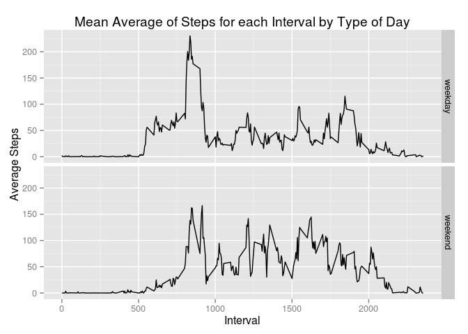

# Reproducible Research: Peer Assessment 1

## Introduction
This document shows the processing steps taken to generate data and graphs for a theoretical complete report about personal activity monitoring devices. 

## Data Source
The data used in this study was obtained in a user study of personal activity monitoring devices. It was obtained when forking this project from [the course's original github](http://github.com/rdpeng/RepData_PeerAssessment1) on 11/12/2014.

## Libraries
This document uses the dplyr library to do the data preprocessing. It also uses the ggplot2 library for the final graph.


```r
library(dplyr)
library(ggplot2)
```

## Loading and preprocessing the data
The data should first be unzipped into the same directory, producing a file named "activity.csv". Once there we can load it into memory in preparation for preprocessing.

The processing // description goes here //


```r
data <- tbl_df(read.csv('activity.csv'))
```

## What is mean total number of steps taken per day?
To answer this question, we first need to summarize the data for each day. For this initial part of the analysis, we are ignoring NA values in the data.


```r
daily_data <- data %>% 
    group_by(date) %>%
    summarize(Total = sum(steps, na.rm = TRUE))
```

With that data we can make a histogram of the total number of steps per day.

```r
hist(daily_data$Total, main="Histogram of Total Number of Steps Taken per Day", xlab="Total Steps Taken")
```

 

So it looks as though the daily total was most often between 10,000 and 15,000 steps. Let's check that by getting the mean for the total steps.

```r
mean(daily_data$Total)
```

```
## [1] 9354
```

Let's inspect the median value too.

```r
median(daily_data$Total)
```

```
## [1] 10395
```

So the mean average is lower than 10,000 (probably due to the larger number of days with less activity), but the median is within the range that the graph showed us.

## What is the average daily activity pattern?
The source data is broken up by "interval" - 5 minute chunks of each day. To answer this question, we get the average of the steps count for each interval instead of the day itself.

```r
interval_data <- data %>% 
    group_by(interval) %>%
    summarize(Avg = mean(steps, na.rm = TRUE))
```

We can plot that as a line graph to see the average daily pattern.

```r
with(interval_data, plot(interval, Avg, type="l", ylab = "Average Steps", xlab = "Interval", main =  "Mean Average of Steps for each Interval"))
```

 

So it appears that most activity occurs around interval #850 or so. We can verify that by sorting the data by the average in descending order, then grabbing the first row.


```r
arrange(interval_data, desc(Avg))[1,]
```

```
## Source: local data frame [1 x 2]
## 
##   interval   Avg
## 1      835 206.2
```

So the interval with the highest average step count is 835.

## Imputing missing values
The NA values in the data may be skewing these results, since we've ignored them so far. How many missing steps values are there in the data set? Let's count.


```r
missing <- sum(is.na(data$steps))
missing
```

```
## [1] 2304
```

Let's compare that to the total size of the data set.


```r
(missing / length(data$steps)) * 100
```

```
## [1] 13.11
```

13% of the rows have missing values! That's definitely significant. So let's **impute** those values - fill them in with data that isn't 100% correct, but is probably close enough. The method we'll use for this is to replace missing values with the mean average for that interval across all days - this makes the assumption that a person's activity is more or less the same at the same time in the day.


```r
filter_NAs <- function(steps, interval) {
    if (is.na(steps)) { 
        default_row <- interval_data[interval_data$interval == interval,]
        default_row[,2]
    } else {
        steps
    }
}
```

Let's apply that to the dataset to get data with no missing values.


```r
imputed_data <- data
imputed_data$steps <- mapply(filter_NAs, data$steps, data$interval)
```

With that fixed, let's make a new histogram and compare that to the previous one.


```r
daily_imputed_data <- imputed_data %>% 
    group_by(date) %>%
    summarize(Total = sum(steps, na.rm = TRUE))

hist(daily_imputed_data$Total, main="Histogram of Total Number of Steps Taken per Day", xlab="Total Steps Taken")
```

 

The lower end of the graph is now drastically different. How about the mean?

```r
mean(daily_imputed_data$Total)
```

```
## [1] 10766
```

And the median?

```r
median(daily_imputed_data$Total)
```

```
## [1] 10766
```

Not only are they identical, but they are significantly higher than the previous measurements.

## Are there differences in activity patterns between weekdays and weekends?
To answer this question we'll create a new factor in our imputed dataset that indicates whether the row is a weekday or weekend.

```r
imputed_data$date <- as.Date(imputed_data$date)
imputed_data <- mutate(imputed_data, 
                        day_type = 
                            ifelse(weekdays(imputed_data$date) == 'Sunday', 'weekend', 
                            ifelse(weekdays(imputed_data$date) == 'Saturday', 'weekend', 'weekday')))
imputed_data$day_type <- as.factor(imputed_data$day_type)
```
Now that we have this factor we can create a dataset that shows the average number of steps taken per day, averaged across either a weekday or weekend day.

```r
interval_imputed_data <- imputed_data %>% 
    group_by(interval, day_type) %>%
    summarize(Avg = mean(steps))
```

Let's plot the data.

```r
ggplot(interval_imputed_data, aes(interval, Avg)) + 
    geom_line() +
    facet_grid(day_type ~ .) +
    ggtitle('Mean Average of Steps for each Interval by Type of Day') + 
    xlab('Interval') + 
    ylab('Average Steps')
```

 

So weekend days on average have a lot more activity than weekdays.
